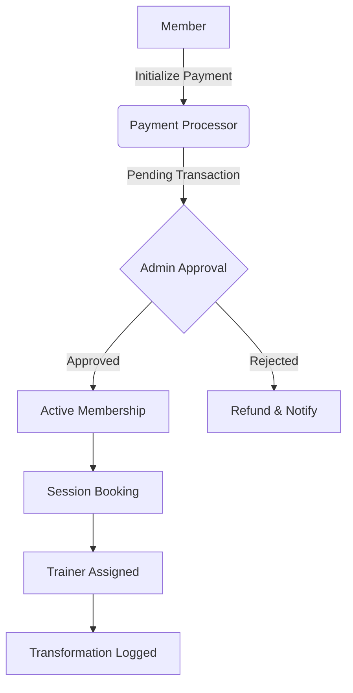

# AlphaMode: The Evolution of Strength

AlphaMode is a premium, smart fitness portal designed to optimize human performance. It bridges the gap between elite coaching and digital convenience, providing a seamless ecosystem for members, trainers, and administrators.

---

## 🚀 Key Features

### 👤 Member Experience

-   **Immersive Dashboards:** Real-time visualization of membership status and upcoming sessions.
-   **Elite Trainer Roster:** Browse and request sessions with industry-leading specialists.
-   **Global Coaching Hub:** 24/7 access to 4K form breakdowns, nutrition guides, and mindset training.
-   **Secure Payments:** Multiple payment gateways (Electronic/Card & Direct/Manual) with mandatory admin verification for high security.
-   **Micro-interactions:** A fluid UI built with Glassmorphism and premium animations.

### 🏋️ Trainer Ecosystem

-   **Personalized Hub:** Manage session requests, schedules, and client progress from a dedicated cockpit.
-   **Performance Tracking:** Monitor member biological identity and goal evolution.

### 🔐 Admin Command Center

-   **Payment Verification:** Robust manual approval system for all transactions to prevent fraud.
-   **Resource Management:** Full CRUD control over trainers, membership tiers, classes, and schedules.
-   **Member Insights:** Holistic view of the active community and growth metrics.

---

## 🛠 Tech Stack

| Layer              | Technology                                                                       |
| :----------------- | :------------------------------------------------------------------------------- |
| **Backend**        | [Laravel 11](https://laravel.com/) (PHP)                                         |
| **Frontend**       | [Laravel Livewire](https://livewire.laravel.com/) (Reactive UI)                  |
| **Interactivity**  | [Alpine.js](https://alpinejs.dev/)                                               |
| **Styling**        | [Tailwind CSS v4](https://tailwindcss.com/) + [daisyUI v5](https://daisyui.com/) |
| **Database**       | MySQL / SQLite                                                                   |
| **Asset Bundling** | [Vite](https://vitejs.dev/)                                                      |
| **Messaging**      | [Mailtrap](https://mailtrap.io/) (Asynchronous Queue Processing)                 |

---

## 📐 Architecture & Workflow



---

## 🛠 Installation & Setup

1. **Clone the repository:**

    ```bash
    git clone https://github.com/yourusername/alphamode.git
    cd alphamode
    ```

2. **Install dependencies:**

    ```bash
    composer install
    npm install
    ```

3. **Configure Environment:**

    ```bash
    cp .env.example .env
    php artisan key:generate
    ```

4. **Initialize Database:**

    ```bash
    php artisan migrate --seed
    ```

5. **Start the Engines:**
    ```bash
    npm run dev
    php artisan serve
    ```

---

## 🧪 Core Philosophy

AlphaMode isn't just a gym portal; it's a **biological optimization system**. Every line of code is written to minimize friction and maximize the user's focus on their ultimate transformation.

---

## ⚖️ License

This project is open-sourced software licensed under the [MIT license](https://opensource.org/licenses/MIT).

---

<p align="center">
  <b>© 2026 AlphaMode — Engineered for Performance</b>
</p>
